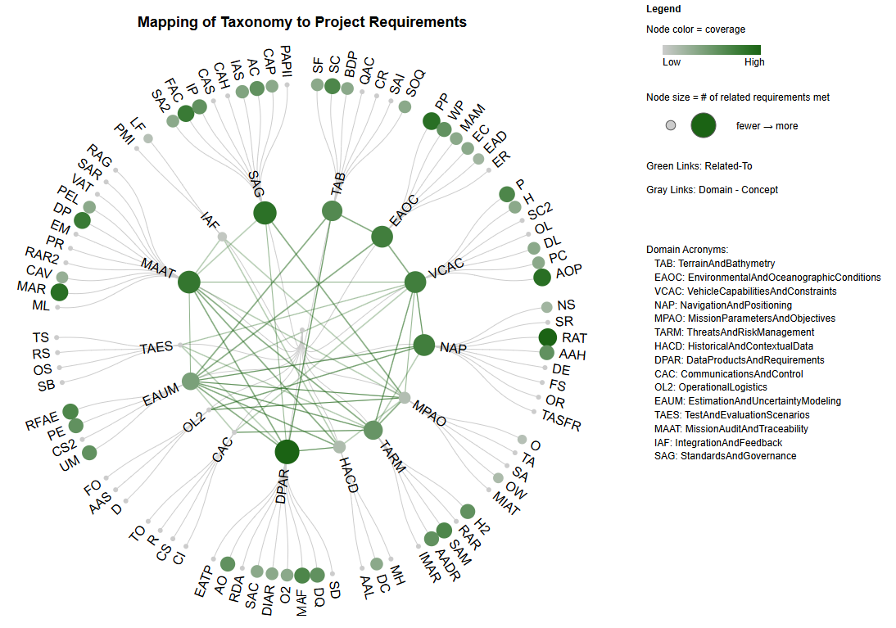

# Uncrewed Underwater Vehicle Route Planning Prototype Trial

## Request for Information Report—Draft

Prepared by: Andrew Hunter on behalf of Surround Australia
Date: 2025-10-14

**Note**: _This assessment of the RAN UUV RFI is preliminary in nature and has not yet been validated by RAN 
Subject-Matter Experts (SMEs). As such, the findings presented here should be considered indicative only and remain 
subject to change following SME review and further consultation._

---
## Table of Contents
1. [Executive Summary](#executive-summary)
2. [Background and Objectives](#background-and-objectives)
3. [Methodology](#methodology)
4. [Marine Navigation Taxonomy](#mission-planning-taxonomy)
5. [Mapping Taxonomy to Requirements](#mapping-taxonomy-to-requirements)
6. [Gaps and Questions](#gaps-and-questions)
7. [Conclusions and Recommendations](#conclusions-and-recommendations)
8. [References](#references)
9. [Appendices](#appendices)

---

## Executive Summary

To be completed post-workshop series.

---

## Background and Objectives

The Uncrewed Underwater Vehicle Route Planning Prototype Trial aims to deliver a system featuring flexible mission 
planning that adapts to diverse and dynamic operational contexts. As part of the co-design process built into the 
project, an initial deliverable was to issue a request for information (RFI) to identify practical scenarios that 
highlight the system's adaptability, leveraging feedback from RAN experts to guide prototype requirements. Key scenarios 
addressed included routing to an operational area (scenario 1), feature detection (scenario 2), beach viability 
assessment (scenario 3), and field observations (scenario 4). Questions focused on mission data, dependencies, 
constraints, risk dimensions, and gaps in current planning processes. These scenarios and the supporting RFI responses 
provide a foundation for iterative development and refinement of the prototype system.

The RFI was initiated by the Royal Australian Navy (RAN) project team with contributions from Surround Australia. The 
RFI was distributed to three RAN subject-matter expert teams mid-September 2025, and their anonymised responses were 
received by Surround Australia early October 2025. The responses were "cleaned" for consistency, aggregated, and 
stripped of all identifying information to ensure confidentiality.

Respondents were asked to consider a series of goals with respect to each scenario. Specifically, they were asked to 
identify and specify requirements for UUV mission planning, to consider data requirements, dependencies and operational 
constraints, and risk dimensions. For scenarios 1 to 3, the following six questions were posed (grouped into three 
themes focusing on route option evaluation, risk evaluation, and data records).

Q1: What test scenarios and supporting data does the system need to provide to support mission planners in evaluating 
route options, based on calculable or estimable factors (e.g. time, usage)?

Q2: What estimable factors should be considered?

Q3: What guidance can be provided regarding the estimation approach?

Q4: What test scenarios and supporting data does the system need to provide to support mission planners in evaluating 
risks for a route?

Q5: When evaluating risks, what specific risks should the system flag?

Q6: What test scenarios and supporting data does the system need to provide to support mission planners in recording 
mission planning data for future review, reuse, or refinement?

Scenario 4 focused on field observations, where the goal was to understand risk profiles that will support mission 
command goals relating to environmental and oceanographic modelling, vehicle performance, and risk tolerances. 
Respondents were asked to consider six tasks (grouped into the same themes as scenarios 1 to 3).

Task 1: Report of current risk profile performance and management systems effectiveness.

Task 2: Analysis of vehicle performance profiles during adverse weather, environmental or restricted waterways.

Task 3: Investigate the quality of sounding operations during mission execution.

Task 4: Capture 'OFFICIAL' level task identifiers and missions plans.

Task 5: Report risk deficiencies or notifiable incidents (i.e. communications, inoperable UUV, etc.).

Task 6: Are the current standards adequate for format and capacity?

A total of 339 responses to the 12 questions were received.

---

## Methodology

The methodology for developing the taxonomy from RFI responses began with assembling and normalising the responses to 
ensure consistency, removal of duplicate content, and expansion of acronyms. Each sentence or phrase was selected as the 
core unit of analysis to maintain semantic clarity for classification purposes. To preserve crucial domain language, a 
set of “must-keep” protected terms was established, and synonym and conflict rules were developed to handle 
context-specific meanings and vocabulary variations. These rules were implemented via JSON maps, ensuring that terms 
like “current” or “depth” were used consistently according to their operational context.

We implemented semi-automated concept mining using TF-IDF–weighted [@das_comparative_2021], n-grams
[@jurafsky_chapter_2025], and co-occurrence graphs [@zvornicanin_graph-based_2023; @nastase_graph-based_2011], via a 
Python pipeline. The pipeline identified candidate concepts that were consolidated (merging similar phrases), de-noised, 
and normalised. The concepts were grouped into mission-planning domains and generically described. New domains were 
added as repeated evidence was identified. Finally, we captured cross-domain dependencies in a RelatedTo graph to 
preserve operational linkages among domains. Once refined, the key ideas were sorted into the main mission-planning 
categories. Finally, we mapped how these categories connect to each other using a simple “related to” structure that 
indicates how different areas of mission planning are related, given the responses.

The taxonomy itself used parent-child relationships, where each domain contained clearly defined child concepts. 
Duplication was minimised through normalisation and cross-referencing of the domains. The structure was iteratively 
refined, with each scenario and set of questions expanding or adjusting taxonomy elements to ensure coverage. A 
validation classification pipeline then assigned taxonomy labels to each response, applying conflict resolution and 
diagnostics to address gaps or misclassifications.

At this stage, 85% of the responses have been classified against the taxonomy.

As noted above, the assessment is preliminary in nature and has not yet been validated by RAN SMEs. It is expected that 
during the upcoming workshops, verification and validation of the taxonomy will be undertaken to verify that responses 
to the RFI have been interpreted appropriately.

---

## Mission Planning Taxonomy

The Mission Planning taxonomy that follows provides a structured classification of key domains and concepts relevant to 
mission planning for uncrewed underwater vehicles (UUVs) as described in the RFI responses. It breaks down SME 
operational knowledge into clearly defined categories that address physical environment factors, vehicle capabilities, 
navigation, mission parameters, risk management, data handling, communications, logistics, evaluation, and governance. 
Each domain captures critical aspects that inform planning, execution, and assessment of missions, enabling consistent 
understanding and communication among stakeholders. The taxonomy supports traceability of decisions, risk awareness, and 
interoperability by linking detailed concepts with broader mission goals and operational contexts. A JSON encoding of 
the taxonomy is included in [Appendix A](#appendix-a-mission-planning-taxonomy). The raw data used to generate the 
taxonomy augmented with classification labels is available in the can also included in 
[Appendix A](#appendix-a-mission-planning-taxonomy).

### Mission Planning Taxonomy – Domain & Concept Descriptions
#### TerrainAndBathymetry

**Domain Description:**
Covers physical features of the seafloor, terrain, and bathymetric data products that inform route planning, safety, and 
survey design. Includes data quality, risk factors, and infrastructure impacts.

- **SurfaceFeatures**: Describes general topography and physical relief (slope, gradient, complexity) of terrain.

- **SeafloorCharacterization**: Classifies seabed properties such as texture, substrate, and geomorphology.

- **BathymetricDataProducts**: Outputs from mapping systems, including multibeam, DEMs, bathymetric grids, and surface 
models.

- **QualityAndConfidence**: Standards and measures of bathymetric data reliability such as zones of confidence (ZoC), 
uncertainty models, and thresholds.

- **CoverageRisks**: Identifies gaps in bathymetric coverage due to terrain shadowing or sensor limitations.

- **SeafloorAndInfrastructure**: Links bathymetric and seafloor data to infrastructure features along a route or area of 
operations.

- **SoundingOperationsQuality**: Factors affecting quality of sounding operations, including vehicle dynamics and 
environmental interference.

---

#### EnvironmentalAndOceanographicConditions

**Domain Description:**
Focuses on physical and dynamic marine processes, water properties, and environmental risks that shape mission 
feasibility and safety.

- **PhysicalProcesses**: Currents, tides, wind, and wave dynamics influencing operations.

- **WaterProperties**: Hydrographic properties of the water column, including temperature, salinity, density, and 
turbidity.

- **MeasurementAndModels**: Methods and tools used to measure/model marine environments (conductivity, temperature, and 
depth (CTD) hindcast/forecast).

- **EnvironmentalContext**: Broader description of conditions and models supporting environmental prediction.

- **EphemeralsAndDynamics**: Short-term, dynamic processes like transient tides and currents.

- **EnvironmentalRisks**: Risks tied to habitat protection, compliance, and ecological sensitivity.

---

#### VehicleCapabilitiesAndConstraints

**Domain Description:**
Defines vehicle hardware, performance, and operational constraints under normal and adverse conditions.

- **Performance**: Core vehicle capabilities including speed, range, endurance, stability, and autonomy.

- **Hardware**: Physical components such as thrusters, batteries, payloads, and communication equipment.

- **SystemConstraints**: Constraints set by equipment limitations, OEM parameters, and fail-safe mechanisms.

- **OperationalLimits**: Mission-level constraints such as launch/recovery limits, stealth, or rules of engagement.

- **DepthLimits**: Maximum and minimum vehicle depth limits and surf zone performance constraints.

- **PerformanceConstraints**: Pre-mission or planned constraints such as endurance limits, communications requirements, 
and bench test results.

- **AdverseOperationalPerformance**: Vehicle performance under stress (currents, acoustic environments, high traffic).

---

#### NavigationAndPositioning

**Domain Description:**
Addresses systems, references, and risks tied to positioning and safe navigation.

- **NavigationSystems**: Tools such as GPS, GNSS, INS, DVL.

- **SpatialReference**: Coordinate systems, datums, EPSG codes.

- **RouteAndTrajectory**: Routes, tracklines, waypoints, and related confidence measures.

- **AccuracyAndHazards**: Navigation accuracy, hazards, no-go zones.

- **DeniedEnvironments**: Scenarios with limited GPS/acoustic/comm access.

- **FailureScenarios**: Navigation failures and drift events.

- **OperationalRisks**: Situational risks (e.g. surfacing in high-traffic areas).

- **TrafficAndSurfaceFixRisks**: Risks from vessel traffic or constrained surface fixing.

---

#### MissionParametersAndObjectives

**Domain Description:**
Captures mission goals, timing, spatial parameters, and traceability of goals across mission phases.

- **Objectives**: Mission goals, tasks, evaluations.

- **TemporalAspects**: Mission timing, phases, scheduling, risks linked to time-on-task.

- **SpatialAspects**: Areas of interest, route feasibility, operating zones.

- **OperationalWindows**: Launch/recovery windows, synchronisation, timestamps.

- **MissionIdentificationAndTraceability**: Metadata tagging for tasks, identifiers, and environmental overlays.

---

#### ThreatsAndRiskManagement

**Domain Description:**
Manages hazards, mitigation, and incident handling. Covers risk modelling, detection risks, and recovery procedures.

- **Hazards**: Threats including communications loss, navigational hazards, adversary influence.

- **ResponseAndRecovery**: Contingency plans, emergency actions.

- **SafetyAndMitigation**: Safety measures, redundancy, collision avoidance.

- **AdversarialAndDetectionRisks**: Detection, cyber, and interference threats.

- **IncidentManagementAndRecording**: Logging of incidents (communications, sensor failures, drift), root cause 
analysis, alerts.

---

#### HistoricalAndContextualData

**Domain Description:**
Captures past mission data, benchmarks, and comparative insights for reuse and refinement.

- **MissionHistory**: Prior missions, archives, reports.

- **DataContext**: Reference datasets, legacy or baseline data.

- **AnalysisAndLearning**: Trends, performance analysis, lessons learned.

---

#### DataProductsAndRequirements

**Domain Description:**
Covers survey outputs, metadata, data standards, and requirements for handling, integrity, and reuse.

- **SurveyData**: Coverage maps, classification, swath width...

- **DataQuality**: Validation, quality control, fusion, confidence scoring.

- **MetadataAndFormat**: Data descriptors and formats that ensure interoperability and traceability.

- **Outputs**: Deliverables and intermediate products used across the mission lifecycle.

- **DataIntegrityAndResilience**: Gaps, anomalies, misalignment's, integrity assurance.

- **StandardsAndCapacity**: Standards compliance, scalability, emerging data types.

- **ReusableDataAssets**: Templates, reusable profiles.

- **AnnotatedOutputs**: Outputs annotated with rationale or environmental overlays.

- **EventAndTelemetryProducts**: Time-aligned products that correlate telemetry, events, and confidence metrics.

---

#### CommunicationsAndControl

**Domain Description:**
Encompasses communications infrastructure, telemetry, and control systems.

- **CommsInfrastructure**: Networks, bandwidth, signals, modems.

- **ControlSystems**: Systems that issue and manage commands, telemetry, and operational control functions.

- **Reliability**: Latency, uplink/downlink stability.

- **TelemetryObservability**: Telemetry logging, synchronisation, packet loss metrics.

---

#### OperationalLogistics

**Domain Description:**
Focuses on deployment, access, and field support for mission execution.

- **Deployment**: Launch/recovery, mobilisation.

- **AccessAndSupport**: Access routes, beach viability, support vessels.

- **FieldOperations**: Field-level planning, constraints, and logistics coordination.

---

#### EstimationAndUncertaintyModeling

**Domain Description:**
Deals with modelling uncertainty, scoring confidence, and adaptive estimation for planning.

- **UncertaintyModeling**: Models and statistical approaches used to quantify uncertainty of data.

- **ConfidenceScoring**: Confidence in detection, classification, positioning.

- **PredictiveEstimation**: Forecasting and predictive analysis for system and environmental performance.

- **RiskFusionAndEffectiveness**: Real-time fusion of environmental/UUV data for risk, adaptive thresholds, 
effectiveness monitoring.

---

#### TestAndEvaluationScenarios

**Domain Description:**
Defines test frameworks, evaluation scenarios, and recordability requirements for mission systems.

- **SystemBenchmarks**: Pre-mission system and sensor checks to ensure readiness.

- **OperationalScenarios**: Test scenarios designed to simulate real-world operational challenges. 

- **RecordabilityScenarios**: Tests that validate record-and-replay functions for mission traceability.

- **TraceabilityScenarios**: Scenarios that validate the completeness of traceability and provenance across decisions 
and events. 

---

#### MissionAuditAndTraceability

**Domain Description:**
Unifies audit, accountability, knowledge traceability, and governance of mission data and decisions.

- **MissionLogging**: Logs of route decisions, mission events, track overlays.

- **MetadataAndRecords**: Logs of MBES metadata, annotated outputs, coverage snapshots.

- **ChecklistAndVerification**: Pre-dive or readiness checklists.

- **RecordAndReplay**: Record-replay of missions, time-aligned telemetry playback.

- **PerformanceRatios**: Task completion ratios, mission efficiency.

- **EffectivenessMetrics**: Risk profile KPIs, management effectiveness, comparative analysis.

- **DecisionProvenance**: Capture rationale for decisions, “who-what-why-when.”

- **PlanExecutionLinkage**: Linking planned assumptions to actual outcomes.

- **VersioningAndTemplates**: Template management and versioning of planning artefacts.

- **SearchAndRetrieval**: Discovery of mission logs and artefacts.

- **RetentionAndGovernance**: Data lifecycle, archival, redaction, compliance retention.

---

#### IntegrationAndFeedback

**Domain Description:**
Captures post-mission feedback, integration of results, and continuous improvement cycles.

- **PostMissionIntegration**: Integration with analysis tools, feedback loops.

- **LearningFeedback**: Lessons learned integrated back into planning cycles.

---

#### StandardsAndGovernance

**Domain Description:**
Defines compliance, interoperability, and security rules for mission data and systems.

- **StandardsAdequacy**: Assessment of standards and adaptability for new data.

- **FormatAndContent**: Support for structured/unstructured data, rich metadata.

- **InteroperabilityProfiles**: Compatibility with defence and OEM standards.

- **CapacityAndScalability**: Scaling data storage and handling for multi-UUV ops.

- **ClassificationAndHandling**: Security tagging, access control, data handling by classification.

- **IdentityAndSignoff**: Signatory and accountability metadata.

- **AccessControl**: RBAC, audit trails, permissions.

- **ComplianceAndPolicy**: Environmental/regulatory compliance, export control.

- **PrivacyAndPII**: Handling of personal data, redaction, consent.

---

## Mapping Taxonomy to Requirements

To understand the scope of the taxonomy, it has been mapped to the project requirements 
[see Appendix B](#appendix-b-uuv-project-requirements). 

As outlined above, the structured mission planning taxonomy is organised into high-level domains such as 
Navigation and Positioning, Terrain and Bathymetry, etc. Each domain was further defined by underlying concepts with 
descriptions and key terms, [see Appendix A](#appendix-a-mission-planning-taxonomy). The taxonomy covers the breadth of 
information relevant to UUV mission planning as described in the RFI responses from RAN SMEs. This taxonomy served as a 
reference framework, providing consistent categories that can show how project requirements are being met.

Using this taxonomy as a foundation, each project requirement  
[see Appendix B](#appendix-b-uuv-project-requirements) was systematically reviewed to determine 
which domains and concepts it addressed. The analysis was not limited to “closest fit” matches; instead, requirements 
were interpreted in terms of their cross-cutting impact. For example, route planning requirements were linked not only 
to <code>NavigationAndPositioning</code>, but also to <code>TerrainAndBathymetry</code>, 
<code>EnvironmentalAndOceanographicConditions</code>, and <code>VehicleCapabilityConstraints</code>. Each mapping was 
annotated with a rationale explaining the relationship, a traceability level (direct or indirect), and an appropriate 
verification method (such as test, simulation, or inspection). The outcome of this process was a traceability chain 
connecting requirements to taxonomy domains and, by extension, to artefacts the system must produce. This ensures 
that coverage can be assessed, gaps can be identified, and the requirements can be refined in line with both SME input 
and the evolving prototype.

Figure 1 shows the mapping of the taxonomy to the project requirements.  The larger the node, the greater the number of 
domains or concepts that addressed a project requirement. This is also reflected in the symbology colour. The greater 
the number of project requirements covered by a domain, or concept, the darker the green. Gray edges represent 
Domain-Concept relationships (essentially parent-child), the green links identify **Related-To** links between taxonomy 
domains. Labels for taxonomy domains have been indicated on Figure 1 below. Labels for domain concepts can be found in 
[Appendix C](#appendix-c-mapping-of-requirements-to-taxonomy).

From a project requirements perspective, the taxonomy clearly covers all requirements. AURRP-02 Sensor Interface maps to 
five domains, AURRP-01 Route Planning and AURRP-16 Route optimisation map to four domains. AURRP-10 Solution must be 
standalone; AURRP-11 Read Only;  AURRP-12 Cyber worthiness, to AURRP-15 Platform Agnostic Design, and AURRP-17 
Adaptability to uncertain environments, all map to two taxonomy domains. The remaining project requirements map to three 
taxonomy domains.

When flipping the mapping from taxonomy to project requirements, the coverage is not as consistent, as is clear in 
Figure 1. There are several domains well represented, including Navigation and Positioning, Terrain and 
Bathymetry, Environmental and Oceanographic Conditions, Data Products and Requirements, Mission Audit and Traceability, 
and Standards and Governance, which together capture a broad set of project requirements. The strongest coverage is 
found in Standards and Governance (39%) of requirements, Data Products and Requirements (33%), and Mission Audit and 
Traceability (33%), with Navigation and Positioning and Environmental and Oceanographic Conditions each at 28%. However, 
coverage is light in Historical and Contextual Data (6%), and Integration and Feedback (6%), while Communications and 
Control, Operational Logistics, and Test and Evaluation Scenarios remain entirely unmapped. These gaps highlight that 
the SMEs view of requirements for the Uncrewed Underwater Vehicle Route Planning prototype is broader than current 
project requirements. 

This is not unexpected as the SME RFI responses suggest that SMEs tended to frame their input at a higher level of 
abstraction, emphasising overarching requirements and principles rather than low-level operational detail.

---

## Gaps and Questions

To be completed post-workshop series.

---

## Conclusions and Recommendations

To be completed post-workshop series.

---

## References

---

## Appendices

---

### Appendix A: Mission Planning Taxonomy

[Mission Planning Taxonomy](https://github.com/surroundaustralia/RAN/blob/main/rfi/rfi_data/output/reduced_mission_planning_taxonomy.json)

[Normalised Classified Responses](https://github.com/surroundaustralia/RAN/blob/main/rfi/rfi_data/output/normalised_all_classified_responses.csv)

---

### Appendix B: UUV Project Requirements

[UUV Project Requirements](https://github.com/surroundaustralia/RAN/blob/main/rfi/rfi_data/output/uuv_requirements.csv)

---

### Appendix C: Mapping of Requirements to Taxonomy

[Mapping of Requirements to Taxonomy](https://github.com/surroundaustralia/RAN/blob/main/rfi/rfi_data/output/mapping_requirements_taxonomy.js)

[Mapping of Domain and Concept labels used on Figure 1 to Taxonomy Domain and Concept Names](https://github.com/surroundaustralia/RAN/blob/main/rfi/rfi_data/output/id_mapping.json)

---
